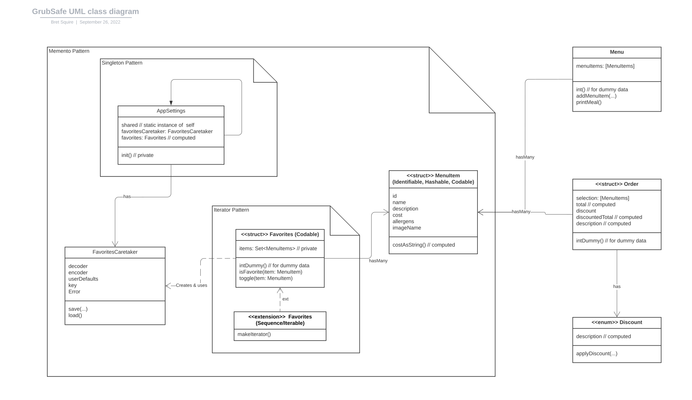

# GrubSafe

This is a minimal contact restaurant app allowing users to view and order meals as well as save their favorite menu items. This app uses an MVVM architecture with SwiftUI, Core Data, Modern Concurrency and Combine.

Class Diagram:

The following are the next set of todo items to refine the app.
- [ ] build a new local testing API with vapor
- [ ] display thumbnail of menu items in menu list view
- [ ] enlarge image on the menu items detail page
- [ ] add cache to the AsyncImage call
- [ ] add feature for user to add a review
- [ ] add feature for user to add image
- [ ] move direct access to the Core Data objectes out of the views
